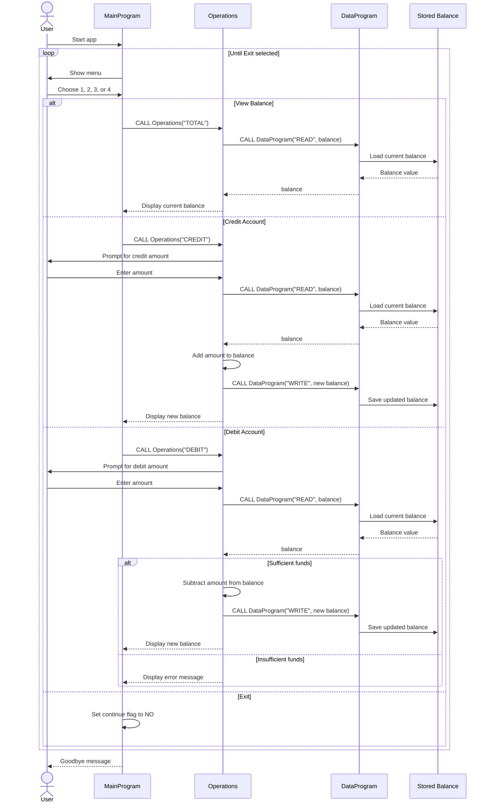

# Modernize your legacy code with GitHub Copilot

Hey akrmcodes!

Mona here. I'm done preparing your exercise. Hope you enjoy! 💚

Remember, it's self-paced so feel free to take a break! ☕️

---

&copy; 2025 GitHub &bull; [Code of Conduct](https://www.contributor-covenant.org/version/2/1/code_of_conduct/code_of_conduct.md) &bull; [MIT License](https://gh.io/mit)

## COBOL Application Overview

This exercise contains a small COBOL account-management app. The current implementation models a balance that can be viewed, credited, or debited. If you treat the balance as a student account, the same flow applies to student deposits, spending, and balance checks.

### File Responsibilities

`src/cobol/main.cob`
`MainProgram` is the entry point. It displays the menu, collects the user's choice, and dispatches to the operations program.

`src/cobol/operations.cob`
`Operations` holds the action logic. It handles view, credit, and debit requests, prompts for amounts when needed, and coordinates with the data program to read or update the balance.

`src/cobol/data.cob`
`DataProgram` acts as the persistence layer. It stores the balance in working storage and responds to `READ` and `WRITE` requests from `Operations`.

### Key Program Flow

1. The user starts the application in `MainProgram`.
2. `MainProgram` shows the menu and accepts a choice from 1 to 4.
3. Option 1 routes to `Operations` to read and display the current balance.
4. Option 2 routes to `Operations`, which accepts a credit amount, reads the current balance, adds the amount, and writes the updated value back.
5. Option 3 routes to `Operations`, which accepts a debit amount, reads the current balance, and subtracts the amount only when sufficient funds are available.
6. Option 4 exits the application.

### Business Rules For Student Accounts

- The starting balance is `1000.00`.
- Viewing the balance does not change the account.
- Credit operations increase the balance by the entered amount.
- Debit operations decrease the balance only if the account has enough funds.
- If funds are insufficient, the debit is rejected and the balance remains unchanged.
- Invalid menu selections are rejected and the menu is shown again.
- Exiting the app stops the menu loop and ends the session.

## App Data Flow

